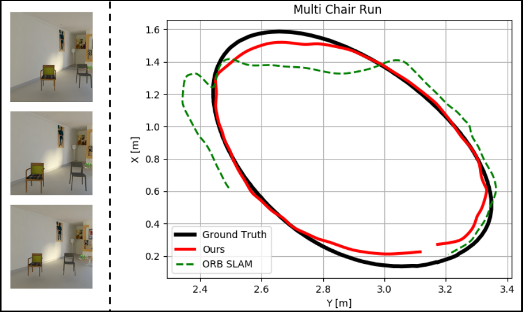

# Reconstruct, Rasterize and Backprop


This repository contains the implementation of the paper [Reconstruct, Rasterize and Backprop: Dense shape and pose estimation from a single image](https://arxiv.org/abs/2004.12232) accepted at CVPR-Workshop on Visual SLAM 2020. The pipeline takes an input RGB image with white background and estimates a dense shape and 6DoF pose with respect to the camera frame. The detailled instructions to reproduce the results are mentioned below.

## Requirements

This code uses Python 2.7+ and PyTorch 0.4.0

The code has been tested only with PyTorch 0.4.0, there are no guarantees that it is compatible with older versions. Currently the library has both Python 3 and Python 2 support.

Refer to the requirements of the occupancy network for more details.

In order to get the initialization from Viewpoint Network, we use [Off-the-shelf Viewpoint Estimator by Render for CNN](https://github.com/shapenet/RenderForCNN/). It requires a caffe interface with pycaffe compiled.

## Getting Started

Clone this repository and make sure that all the dependencies are in place.

1.	Now create a custom shapenet dataset with chairs on a white background. In case of real images use a manually annotated mask to extract the chair object.
2.	Create a ground truth view parameters list for the given dataset with shapenet chair id, image name, azimuthal angle, elevation, in place rotation and radius. 
3.	After dataset preparation, follow the instructions for the occupancy network to get the mesh in cannonical form.
4.	Next, in order to rescale the obtained o-net mesh according to the ground truth camera height follow the instructions to run the code rescale_mesh.py.
5.	For giving a crude initialization to the renderer use the view point network given by [Render for CNN](https://github.com/shapenet/RenderForCNN/).
6.	After getting the rescaled meshes and the initialization from the view point network run the differentiable neural mesh renderer. Also compute the 3D bounding boxes and rotation matrices for evaluations.
```
python3 run_nr_batch_rfcnn.py <view_parameters_file> <rescaled_mesh_dir> <input_img_dir>
python3 save_bb.py <gt_mesh_dir> <gt_view_params> <rescaled_mesh_dir> <pred_view_params_dir>
python3 save_R.py <gt_view_params> <pred_view_params_dir>
```
7.	The renderer will optimize the mesh iteratively and return the 6 Dof pose of the object in the camera frame.

## Object-centric egomotion Estimation

We further extend our results to an offline setup where we demonstrate object-centric egomotion estimation and compare camera trajectories with the monocular ORB SLAM. The results on the synthetic sequences rendered in Blender are shown below. For more details refer to Section 4.1 of the paper.




## Citation

If you find our code or paper useful please consider citing

```
@inproceedings{Occupancy Networks,
	title = {Occupancy Networks: Learning 3D Reconstruction in Function Space},
	author = {Mescheder, Lars and Oechsle, Michael and Niemeyer, Michael and Nowozin, Sebastian and Geiger, Andreas},
	booktitle = {Proceedings IEEE Conf. on Computer Vision and Pattern Recognition (CVPR)},
	year = {2019}
}
```

```
@InProceedings{kato2018renderer
	title={Neural 3D Mesh Renderer},
	author={Kato, Hiroharu and Ushiku, Yoshitaka and Harada, Tatsuya},
	booktitle={The IEEE Conference on Computer Vision and Pattern Recognition (CVPR)},
	year={2018}
}
```